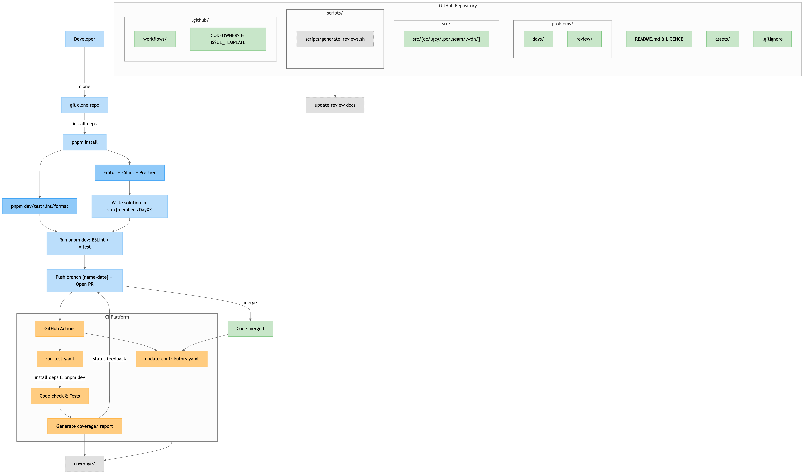

# 506 实验室 · 每日一题🚀



数据结构 / 算法 / JS 原理实现 / 工程实践 的“日更式”练习与复盘仓库。强调：小步快跑 · 测试驱动 · 渐进式类型 · 复盘沉淀。

## 🏗️ 概览

```
one-question-per-day/
├── packages/
│   ├── problems/              # 题库（按 Day 分组）
│   ├── core/                  # 成员个人/分路线实现（dc / pc / gcy / seam / wdn ...）
│   │   └── <member>/Day XX/   # 各自的实现 & 练习
│   ├── docs/                  # 文档站 (VitePress) + Days / Review / 发布说明
│   └── utils/                 # 工具脚本 / 产物打包辅助
├── assets/                    # 公共静态资源
├── scripts/                   # release / 生成日志 等脚本
├── dist/                      # 构建后产物（题库打包 zip 等）
├── coverage/                  # 测试覆盖率报告
├── pnpm-workspace.yaml        # Workspace 声明（多层 * 匹配）
├── vite.config.ts             # 题库打包 / 多插件（vue + react）
├── vitest.config.ts           # 测试配置
├── CHANGELOG.md / RELEASE_NOTES.md
└── README.md
```

## 🥅 目标

- 高频稳定的编程练习节奏
- 测试驱动、快速反馈与安全重构
- 多解策略对比（暴力 → 优化 / 空间换时间 / 结构变换）
- 渐进式引入 TypeScript，沉淀抽象边界
- 复盘体系化：错因 / 边界 / 优化思路可追溯

## 🚀 快速开始

```bash
pnpm install          # 安装所有 workspace 依赖
pnpm test             # 跑所有 Vitest 测试
pnpm dev              # 根脚本：lint+test（见 scripts）

# 文档站（如果 scripts 仍为 vitepress dev docs 且内容不在 docs/ 子目录，可调整为 '.'）
pnpm docs:dev

# Vue playground（题目可视化）
pnpm play:dev
```

## 🧪 测试 & 质量

| 维度     | 工具                  | 说明                         |
| -------- | --------------------- | ---------------------------- |
| 单元测试 | Vitest                | 快速反馈 / 快速定位回归      |
| 覆盖率   | `@vitest/coverage-v8` | 聚焦未测逻辑，避免盲测       |
| 代码质量 | ESLint + Prettier     | 统一风格与潜在错误检测       |
| 类型安全 | TypeScript 5.x        | 渐进增强，不做一口气全量重写 |

运行局部测试：

```bash
pnpm vitest run packages/problems/**/Day\ 10/*.spec.*
```

## 📖 复盘内容

集中收录在：

- `packages/docs/review/`：阶段总结、共性错误、优化策略
- `packages/docs/days/`：题目索引 / 进度概览

> 🧠 建议：复盘时写下 “初始直觉 → 复杂点 → 最终取舍”。

## 🕹️ Playground

`@one-question-per-day/vue` 子包用于快速在浏览器中演练题目（或对比响应式实现等）。常见做法：

1. 在对应 Day 目录下放置 `demo/vue/App.vue`（或约定路径）。
2. 启动：
   ```bash
   pnpm play:vue
   pnpm play:react
   ```

## 🧬 渐进式 TS 策略

原则：价值优先 & 可读性第一。

- 只为具有“复用 / 抽象潜力”的题目补类型
- 用测试反演类型边界（失败用例驱动补充）
- 避免过度复杂条件类型；必要时在 `ts/` 子目录里做实验版本

## 🤝 贡献者

<!-- readme: contributors -start -->
<table>
	<tbody>
		<tr>
            <td align="center">
                <a href="https://github.com/seaeam">
                    
                    <br /><sub><b>lll</b></sub>
                </a>
            </td>
            <td align="center">
                <a href="https://github.com/pcppp">
                    
                    <br /><sub><b>peng chang</b></sub>
                </a>
            </td>
            <td align="center">
                <a href="https://github.com/xiersiki">
                    
                    <br /><sub><b>Gong Che Yu</b></sub>
                </a>
            </td>
            <td align="center">
                <a href="https://github.com/Dc9309">
                    
                    <br /><sub><b>Dc9309</b></sub>
                </a>
            </td>
            <td align="center">
                <a href="https://github.com/notshine">
                    
                    <br /><sub><b>Peng Liang</b></sub>
                </a>
            </td>
            <td align="center">
                <a href="https://github.com/wang-danni">
                    
                    <br /><sub><b>wang-danni</b></sub>
                </a>
            </td>
		</tr>
	<tbody>
</table>
<!-- readme: contributors -end -->

---

## ⚖️ License

MIT © 506 Lab

> Keep shipping small improvements. Solve · Reflect · Evolve.
