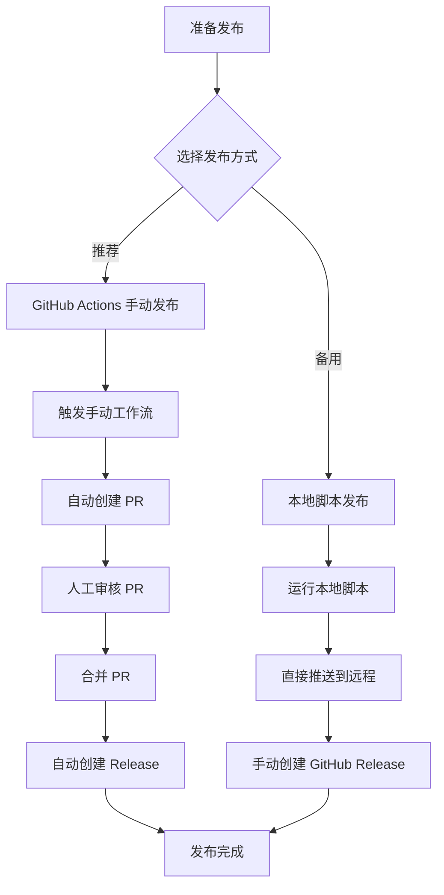

# 🚀 Release 工作流指南

## 📋 Release 流程概览



## 🎯 方法一：GitHub Actions 手动发布（推荐）

### 优势

- ✅ 完全自动化的版本管理
- ✅ 自动生成 Release Notes
- ✅ 包含完整的 CI/CD 检查
- ✅ 支持 PR 审核流程
- ✅ 自动创建发布包

### 操作步骤

#### 1. 触发发布工作流

1. 访问 [GitHub Actions 页面](https://github.com/506-FETL/one-question-per-day/actions)
2. 选择 "手动 Release" 工作流
3. 点击 "Run workflow"
4. 选择参数：
   - **版本类型**: `patch`/`minor`/`major`
   - **自定义版本**: 可选，格式如 `v2.5.0`
   - **跳过测试**: 紧急发布时可选

#### 2. 等待工作流完成

工作流会自动：

- 🧪 运行所有测试和检查
- 📊 统计项目信息（题目数量、贡献者）
- 📝 生成版本号和 Release Notes
- 📦 创建发布包
- 🔄 更新 `package.json` 和 `CHANGELOG.md`
- 🌟 创建 Release 分支和 PR

#### 3. 审核和合并 PR

1. 访问自动创建的 PR
2. 检查版本更新内容：
   - `package.json` 版本号
   - `CHANGELOG.md` 新增条目
3. 等待所有 CI 检查通过 ✅
4. 合并 PR 到 `main` 分支

#### 4. 自动完成发布

合并后自动触发：

- 🏷️ 创建 Git Tag
- 📋 创建 GitHub Release
- 📦 上传发布包

## 🛠️ 方法二：本地脚本发布（备用）

### 适用场景

- 网络问题无法使用 GitHub Actions
- 需要快速发布补丁
- 开发环境测试

### 操作步骤

#### 1. 准备环境

```bash
# 确保在项目根目录
cd /path/to/one-question-per-day

# 确保在 main 分支且工作区干净
git checkout main
git pull origin main
git status
```

#### 2. 运行发布脚本

```bash
# 补丁版本 (2.1.3 -> 2.1.4)
./cmd/release.sh patch

# 次版本 (2.1.3 -> 2.2.0)
./cmd/release.sh minor

# 主版本 (2.1.3 -> 3.0.0)
./cmd/release.sh major

# 自定义版本
./cmd/release.sh custom v2.5.0
```

#### 3. 手动创建 GitHub Release

脚本完成后需要手动：

1. 访问 [GitHub Releases 页面](https://github.com/506-FETL/one-question-per-day/releases)
2. 点击 "Create a new release"
3. 选择刚创建的 tag
4. 复制脚本生成的 Release Notes
5. 发布 Release

## 📏 版本号规范

我们遵循 [语义化版本](https://semver.org/lang/zh-CN/) 规范：

### 格式：`vMAJOR.MINOR.PATCH`

- **MAJOR**: 不兼容的 API 修改
- **MINOR**: 向下兼容的功能性新增
- **PATCH**: 向下兼容的问题修正

### 版本类型选择指南

| 变更类型      | 版本类型 | 示例            |
| ------------- | -------- | --------------- |
| 🐛 修复 bug   | `patch`  | v2.1.3 → v2.1.4 |
| ✨ 新增功能   | `minor`  | v2.1.3 → v2.2.0 |
| 💥 破坏性改动 | `major`  | v2.1.3 → v3.0.0 |
| 🚀 重大发布   | `major`  | v2.1.3 → v3.0.0 |

## 📝 Release Notes 格式

自动生成的 Release Notes 包含：

```markdown
# 📚 506实验室每日一题 Release vX.Y.Z

## 🎯 本次更新概览

[更新概述]

## 📝 详细更新内容

[从 updates/ 目录自动提取]

## 📊 项目统计

- 📚 总题目数量: **N** 题
- 👥 贡献者数量: **N** 人

## 📦 发布包下载

[自动生成的下载链接和校验码]

## 🛠️ 技术栈

[技术栈信息]

## 🚀 快速开始

[使用说明]

## 🤝 参与贡献

[贡献指南链接]
```

## 🔍 质量检查清单

每次发布前确保：

### 代码质量

- [ ] 所有测试通过 (`pnpm test`)
- [ ] 代码格式正确 (`pnpm lint`)
- [ ] 类型检查通过 (`pnpm type-check`)

### 文档更新

- [ ] README.md 信息是否需要更新
- [ ] 新功能是否有对应文档
- [ ] CHANGELOG.md 格式正确

### 版本管理

- [ ] 版本号符合语义化版本规范
- [ ] Git 工作区干净
- [ ] 在正确的分支（main）

## 🚨 应急发布流程

如果需要紧急修复：

1. **创建热修复分支**

   ```bash
   git checkout -b hotfix/v2.1.4
   # 进行必要的修复
   git commit -m "fix: 紧急修复问题"
   ```

2. **快速发布**

   ```bash
   # 使用本地脚本快速发布
   ./cmd/release.sh patch
   ```

3. **同步到主分支**
   ```bash
   git checkout main
   git merge hotfix/v2.1.4
   git push origin main
   ```

## 📞 支持和反馈

遇到发布问题时：

1. 检查 [GitHub Actions 日志](https://github.com/506-FETL/one-question-per-day/actions)
2. 查看 [Issues 页面](https://github.com/506-FETL/one-question-per-day/issues)
3. 联系项目维护者

---

**记住**: 优先使用 GitHub Actions 手动发布，它提供了最完整和安全的发布流程！ 🎉
