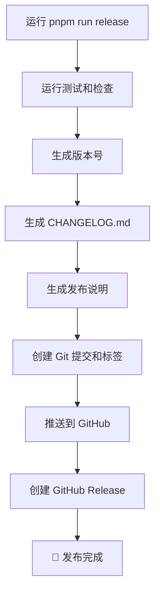

# 🚀 自动发布说明系统

## ✨ 功能概述

本项目已配置完整的自动发布说明生成系统，每次发布时都会自动生成格式化的发布说明。

## 🎯 主要特性

### 1. 🤖 自动化发布流程

- **自动生成 CHANGELOG.md** - 基于 conventional commits
- **格式化发布说明** - 包含表情符号和结构化内容
- **GitHub Release 集成** - 自动用于 GitHub Release

### 2. 📝 发布说明内容

- 🐛 Bug 修复
- ✨ 新功能
- ⚡ 性能改进
- 💥 破坏性更改
- 📚 文档更新
- 🧪 测试改进
- 🔧 其他更改

### 3. 🛠️ 便捷命令

```bash
# 🎉 完整发布流程（推荐）
pnpm run release

# 📋 仅生成发布说明
pnpm run generate-release-notes

# 👀 预览发布说明
cat RELEASE_NOTES.md
```

## 📚 使用指南

### 快速开始

1. **提交代码时使用规范格式**：

   ```bash
   git commit -m "feat: 添加新功能"
   git commit -m "fix: 修复重要 bug"
   git commit -m "docs: 更新文档"
   ```

2. **运行发布命令**：

   ```bash
   pnpm run release
   ```

3. **系统会自动**：
   - ✅ 运行测试和检查
   - ✅ 生成 CHANGELOG.md
   - ✅ 生成格式化的发布说明
   - ✅ 创建 Git 标签
   - ✅ 推送到 GitHub
   - ✅ 创建 GitHub Release（包含发布说明）

### 提交规范

为了生成高质量的发布说明，请使用 [Conventional Commits](https://www.conventionalcommits.org/) 规范：

| 类型        | 描述      | 示例                     |
| ----------- | --------- | ------------------------ |
| `feat:`     | 新功能    | `feat: 添加用户登录功能` |
| `fix:`      | Bug 修复  | `fix: 修复登录失败问题`  |
| `docs:`     | 文档更新  | `docs: 更新 API 文档`    |
| `style:`    | 代码格式  | `style: 修复代码缩进`    |
| `refactor:` | 代码重构  | `refactor: 重构用户模块` |
| `perf:`     | 性能优化  | `perf: 优化查询性能`     |
| `test:`     | 测试相关  | `test: 添加单元测试`     |
| `chore:`    | 构建/工具 | `chore: 更新依赖包`      |

## 🔧 技术详情

### 核心文件

```
.release-it.json              # Release-it 主配置
scripts/
  ├── generate-release-notes.js  # 发布说明生成器
  └── get-release-notes.js       # GitHub Release 发布说明获取器
docs/
  └── RELEASE_NOTES_TEMPLATE.md  # 详细文档和模板
```

### 发布流程图



### 配置说明

```json
{
  "github": {
    "release": true,
    "releaseName": "Release v${version}",
    "releaseNotes": "node scripts/get-release-notes.js"
  },
  "hooks": {
    "before:init": ["pnpm run dev"],
    "after:bump": "node scripts/generate-release-notes.js"
  }
}
```

## 🎨 发布说明示例

```markdown
## 🎉 Release v1.2.0

✨ **Features**

- 每日一题-- myFrom 函数，支持类数组对象和可迭代对象的转换
- 每日一题--生成器函数转换为异步函数

🐛 **Bug Fixes**

- 修复 ts 错误
- 修正 ESLint 配置中的路径别名

📚 **Documentation**

- 更新项目文档，添加每日一题描述文件

---

💡 **完整更改日志**: [CHANGELOG.md](./CHANGELOG.md)
📦 **安装**: `git clone` 或下载最新版本
🐛 **发现问题?** 请提交 [Issue](../../issues)
```

## 🔍 故障排除

### 常见问题

1. **发布说明为空**
   - 确保使用了 conventional commits 格式
   - 检查 CHANGELOG.md 是否正确生成

2. **GitHub Token 问题**
   - 确保 `.env` 文件中的 `GITHUB_TOKEN` 正确设置
   - Token 需要 `repo` 权限

3. **脚本执行失败**
   - 确保 Node.js 版本 >= 18
   - 检查 `scripts/` 目录下的文件是否可执行

### 调试命令

```bash
# 检查 Git 状态
git status

# 手动测试发布说明生成
pnpm run generate-release-notes

# 预览发布说明
node scripts/get-release-notes.js

# 检查 CHANGELOG
cat CHANGELOG.md
```

## 🤝 贡献指南

要为此项目贡献，请：

1. Fork 此仓库
2. 创建功能分支：`git checkout -b feat/amazing-feature`
3. 使用规范提交：`git commit -m "feat: add amazing feature"`
4. 推送分支：`git push origin feat/amazing-feature`
5. 提交 Pull Request

## 📄 许可证

本项目遵循项目根目录中的 LICENSE 文件。
